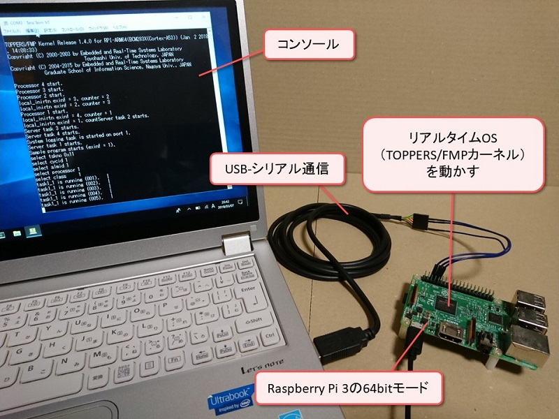

# RPi64Toppers

Raspberry Pi 64bitモード向けリアルタイムOS

## 概要



 - TOPPERS/FMPカーネルを移植 (https://www.toppers.jp)
 - Raspberry Pi 3のARMv8 AArch64モードで動作
 - 4コアでマルチコア動作
 - キャッシュとMMUはON
 - 各コアのARM Generic Timerを使用
 - Raspberry PiのMini UARTを使用
 - 例外レベル3(EL3)でブートして例外レベル1ノンセキュア(EL1NS)でカーネル動作
 - 割込み優先度のハードウェア機能が無いためソフトウェアで疑似的に再現
 - QEMU（エミュレータ）を用いた実機レスの動作も可能
 - デバッグ用途向けに実行ファイルをロードするツールも提供

 - - -

## 目次

 - [Raspberry Pi 3を用いた動作方法](#Raspberry-Pi-3を用いた動作方法)
 - [QEMUを用いた動作方法](#QEMUを用いた動作方法)
 - [デバッグ用途向けローダ](#デバッグ用途向けローダ)

 - - -

## Raspberry Pi 3を用いた動作方法

### 必要な機材

 - Raspberry Pi 3 + 電源
 
 - microSDカード + カードリーダ  
FAT32フォーマットされたmicroSDカードを用意する．  
数十MB程度の空きがあれば十分である．
 
 - USB-シリアル変換ケーブル  
シリアルコンソールで通信するために使用する．  
TTL-232R-3V3を使用した．

 - PC（Windows / Linuxどちらでも可）  
ビルド，および動作に使用する．

### 開発環境の構築

 - コンパイラ  
以下からフリーのARMv8 AArch64用コンパイラを入手する．  
https://www.linaro.org/downloads/  
Versionは`gcc-linaro-6.3.1-2017.02-xxx_aarch64-elf`を使用した．  
xxxはPC環境によって適切なものを選択する．  
ダウンロードして適当な場所に展開したら以下にpathに通す．  
`<展開したディレクトリ>/gcc-linaro-6.3.1-2017.02-xxx_aarch64-elf/bin`

 - コンフィギュレータ  
以下からコンフィギュレータを入手する．  
https://www.toppers.jp/cfg-download.html  

 - ターミナルアプリ  
シリアルコンソールで通信するためにTera Term，GTKTermなどをインストールしておく．

 - その他ツール  
おそらく以下パッケージが必要となる．  
make, perl, git, gcc-core, gcc-g++

### ビルド

このリポジトリを取得してfmp.binをビルドする．
```
git clone https://github.com/YujiToshinaga/RPi64Toppers.git
cd RPi64Toppers/fmp
mkdir -p cfg/cfg
mv <コンフィギュレータを展開したディレクトリ>/cfg cfg/cfg
chmod 755 cfg/cfg/cfg
mkdir build
cd build
perl ../configure -T rpi_arm64_gcc
make fmp.bin
```

### 動作準備

#### SDカードの準備

FAT32フォーマットされたSDカード直下に以下の4ファイルを置いてRaspberry Piに挿す．

 - bootcode.bin, start.elf  
以下から`bootcode.bin`と`start.elf`をダウンロードする．  
https://github.com/raspberrypi/firmware/tree/master/boot

 - config.txt  
このリポジトリの`RPi64Toppers/fmp/targets/rpi_arm64_gcc/config.txt`を使用する．
 
 - fmp.bin  
ビルドした`fmp.bin`を使用する．

#### シリアルコンソールの接続

Raspberry PiのGPIO14(TXD1), GPIO15(RXD1), GroundをそれぞれUSB-シリアル変換ケーブルのRXD，TXD，Groundと接続する．  

Raspberry Piのピン配置  
https://www.raspberrypi.org/documentation/usage/gpio/README.md

TTL-232R-3V3を使用する場合

RPiのピン | 結線 | TTL-232R-3V3のピン
---|---|---
GPIO14(TXD1) | - | Yellow(RXD)
GPIO15(RXD1) | - | Orange(TXD)
Ground | - | Ground |

PCとUSB-シリアル変換ケーブルを接続し，ターミナルアプリからシリアルコンソールを開く．  
ボーレートは115200bpsを設定する．

### 起動

Raspberry Piの電源を入れる．

 - - -

## QEMUを用いた動作方法

### 必要な機材

 - Linux PCのみ  
ビルド，および動作に使用する．  
VirtualBox＋Ubuntu 16.04を使用した．

### 開発環境の構築とビルド

前述のRaspberry Piを用いた動作と同様にfmpをビルドして，
`RPi64Toppers/fmp/build/fmp`を生成する．

QEMUをビルドしてインストールする．

```
git clone git://git.qemu.org/qemu.git
cd qemu
# git checkout stable-2.12  # 2018/10/26時点の最新stableにはUART割込みにバグがありmasterを使用する
git submodule init
git submodule update --recursive
cd ..
mkdir qemu_build
cd qemu_build
../qemu/configure --prefix=~/opt/qemu --target-list=aarch64-softmmu
make
make install
```

`~/opt/qemu/bin`にpathを通す．

### 起動

ビルドした`fmp`を引数に指定して以下を実行する．

```
qemu-system-aarch64 -M raspi3 -m 256 -serial null -serial mon:stdio -kernel fmp -nographic -smp 4
```

終了するには Ctrl-a, x を実行する．

 - - -

## デバッグ用途向けローダ

[Binary Loader for Raspberry Pi AArch64](/loader)

PCでビルドしたTOPPERS/FMPカーネルをUSB-シリアル通信でRaspberry Piに転送＆実行可能にする．  
ビルドする度にいちいちSDカードを抜き差ししてロードする手間を省くことができる．

