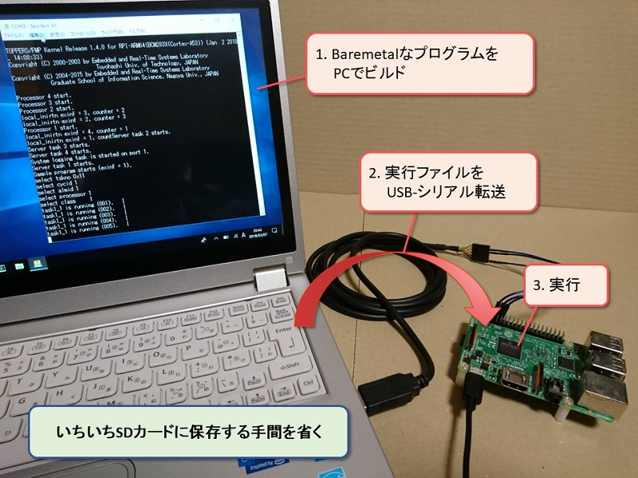

# Binary Loader for Raspberry Pi AArch64

PCでビルドしたBaremetalやリアルタイムOSの実行ファイルを  
USB-シリアル通信でRaspberry Piに転送＆実行可能にするツール

## 概要



 - バイナリをシリアル転送して実行可能
 - 転送プロトコルは単純なXMODEM
 - Raspberry Pi 3のARMv8 AArch64モードで動作
 - 4コアでマルチコア実行
 - ジャンプ後は例外レベル1ノンセキュア(EL1NS)でキャッシュとMMUはOFF

## 使い方

### 必要な機材

 - Raspberry Pi 3 + 電源
 
 - microSDカード + カードリーダ  
 
 - USBシリアル変換ケーブル  
TTL-232R-3V3を使用した．

 - PC（Windows / Linuxどちらでも可）  

### 開発環境の構築

 - コンパイラ  
以下からフリーのARMv8 AArch64用コンパイラを入手する．  
https://www.linaro.org/downloads/  
Versionは`gcc-linaro-6.3.1-2017.02-xxx_aarch64-elf`を使用した．  
xxxはPC環境によって適切なものを選択する．  
ダウンロードして適当な場所に展開したら以下にpathに通す．  
`<展開したディレクトリ>/gcc-linaro-6.3.1-2017.02-xxx_aarch64-elf/bin`

 - ターミナルアプリ  
Tera Termを利用した．  
Tera TermのXMODEMファイル送信機能を使用する．

 - その他ツール  
おそらく以下パッケージが必要となる．  
make, git, gcc-core

### ビルド

このリポジトリを取得してloader.binをビルドする．
```
git clone https://github.com/YujiToshinaga/RPi64Toppers.git
cd RPi64Toppers
git checkout develop
cd loader
make
```

### 動作準備

#### SDカードの準備

FAT32フォーマットされたSDカード直下に以下の4ファイルを置いてRaspberry Piに挿す．

 - bootcode.bin, start.elf  
以下から`bootcode.bin`と`start.elf`をダウンロードする．  
https://github.com/raspberrypi/firmware/tree/master/boot

 - config.txt  
このリポジトリの`RPi64Toppers/loader/config.txt`を使用する．
 
 - loader.bin  
ビルドした`RPi64Toppers/loader/loader.bin`を使用する．

#### シリアルコンソールの接続

Raspberry PiのGPIO14(TXD1), GPIO15(RXD1), GroundをそれぞれUSB-シリアル変換ケーブルのRXD，TXD，Groundと接続する．  

Raspberry Piのピン配置  
https://www.raspberrypi.org/documentation/usage/gpio-plus-and-raspi2/README.md

TTL-232R-3V3を使用する場合

RPiのピン | 結線 | TTL-232R-3V3のピン
---|---|---
GPIO14(TXD1) | - | Yellow(RXD)
GPIO15(RXD1) | - | Orange(TXD)
Ground | - | Ground |

PCとUSB-シリアル変換ケーブルを接続し，ターミナルアプリからシリアルコンソールを開く．  
ボーレートは115200bpsを設定する．

### 実行

 1. Raspberry Piの電源ON

 2. 実行ファイル転送の許可  
Tera Termのコンソール上でyを入力する．

 3. 実行ファイルの転送  
Tera Termの「ファイル」 -> 「転送」 -> 「XMODEM」 -> 「送信」を選択して実行したいバイナリを送信する．  
TOPPERS/FMPカーネルであればfmp.binを送信する．

 4. しばらく待機

 5. 実行  
転送完了すると自動的に転送したバイナリの先頭から実行を開始する．

## ソフトウェア構成

### 実行フロー

1. Rapberry Piに本プログラムを入れて電源ON

2. 0x0番地から実行開始  
1つめの命令が0x00100000番地へのjump命令になっている．

3. 0x00100000番地へジャンプ  

4. 初期化処理を実行  
GPIO，シリアルなどのデバイスの初期化をする．  
キャッシュ領域（0x00180000～）を定義する．  
MMU，キャッシュをオンにする．

5. キャッシュ領域（0x00180000番地）へジャンプ．

6. 転送処理を実行  
XMODEMプロトコルでバイナリ受信を行う．  
バイナリはキャッシュ領域（0x00200000番地）に一時的に保存する．

7. 0x0番地にバイナリをロード  
キャッシュ領域に保存したバイナリを0x0番地にコピーする．

8. 非キャッシュ領域にリターン  
MMU, キャッシュをオフにする．

9. 0x0番地にジャンプ

10. ロードしたバイナリを実行

バイナリ転送処理はキャッシュオン状態で実行しないと，転送処理が間に合わなくなりデータ欠落を起こしてしまう．
一方で，ロードしたバイナリの実行は0x0番地から初期状態（=キャッシュオフ状態）で実行したい．

そのため部分的にキャッシュオン領域を定義して転送処理を行い，その後キャッシュ内容をメモリに書き戻してメモリ管理を初期化してから0x0番地からバイナリを実行する構成になっている．

### メモリマップ


```
 +------------------------------+ 0x00000000
 | Space for loaded binary      |
 |   1MB                        |
 |                              |
 +------------------------------+ 0x00100000
 | Boot code                    |
 |   Main part of loader.S      |
 |   Non-cached area            |
 +------------------------------+
 | Loader                       |
 |   loader.c                   |
 |   Non-cached area            |
 +------------------------------+
 | Stack section                |
 |   Non-cached area            |
 |                              |
 +------------------------------+ 0x00180000
 | Main loader                  |
 |   loader_cached.c            |
 |   Cached area                |
 +------------------------------+
 | Stack section                |
 |   Cached area                |
 |                              |
 +------------------------------+ 0x00200000
 | Temporary space for binary   |
 |   Cached area                |
 |   1MB                        |
 |                              |
 +------------------------------+ 0x00300000
 |                              |
 |                              |
```

